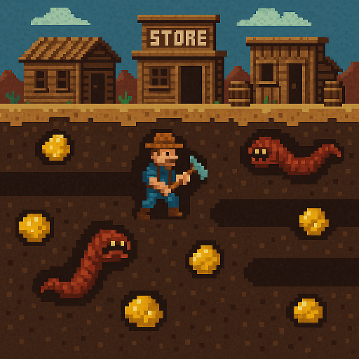

# Gold Digger 🎮

Gold Digger is a retro-style casual mining game inspired by the classic *Digger*. Built with React, TypeScript, and Canvas, it features pixel-art animations, tile-based movement, enemies, collectibles, and a decorative banner.

This project is implemented using [Vite](https://vitejs.dev/) for lightning-fast development and modern tooling.

## 🚀 Getting Started

### Prerequisites

Make sure you have the following installed:

- [Node.js](https://nodejs.org/) (v18 or newer recommended)
- [npm](https://www.npmjs.com/) (or use `pnpm` / `yarn`)

### 📦 Installation

Clone the repository and install dependencies:

```bash
git clone https://gitlab.com/your-username/gold-digger.git
cd gold-digger
npm install
```

### 🏃‍♂️ Run the game locally

```bash
npm run dev
```

This will start the Vite development server. Open your browser to:

```
http://localhost:5173/
```

### 🔨 Build for production

```bash
npm run build
```

To preview the production build:

```bash
npm run preview
```

## 🧪 Linting & Code Quality

This project comes with a basic ESLint setup. To check for lint errors:

```bash
npm run lint
```

You can expand your ESLint config with stricter and type-aware rules if needed.

## 🧩 Tech Stack

- React + TypeScript
- Canvas 2D rendering
- Vite (bundler)
- ESLint (optional lint rules)

## 📝 License

MIT License

---
Happy digging! ⛏️
